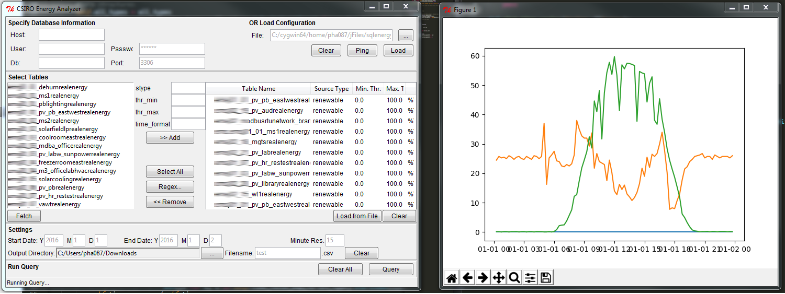

# SQL Energy Usage Analyser
Python wrapper to query MySQL database and retrieve energy time series data from multiple sources.
The script calculates the usage of energy for various groups of sources in a time-series format for further analysis



# Installation

Currently, this software only supports Python 2.7.x 32-bit on Windows machines.

1. Install [`git`](https://git-for-windows.github.io/)
2. Install [Python 2.7 (32-bit)](https://www.python.org/downloads/windows/)
3. Clone this repository
4. Run the `install.bat` file (double-click in Windows)

The software should be ready to run.

# To Run

1. Go to the repository
2. Run the `run.bat` file

# Updating

Because this repository is maintained with `git`, simply pulling from `master` will update
the software.

Alternatively, simply running the `install.bat` file will update the software

# Database Credentials

Database credentials must specify the host, user, password, database name, and port.

This information may be specified in `json` or `csv` format. Alternatively, manually entering this data is supported. `csv` files must be header-less, with the first column being the field and the second the value.

Strictly, the fields must be either `host`, `user`, `passwd`, `db`, or `port`

`json` Files must be in the format:

```json
    {
        "host": "1xx.xxx.xxx.xxx",
        "user": "uuuuuuu",
        "passwd": "pppppp",
        "db": "dddd",
        "port": "3306"
    }
```

# Table List
The table list is the list of tables that the sript will query from the specified database.

Currently, the table list must be a plain text file, with `csv` rows of at least 2 columns. The first column is the table name, and the second column is the source type. These columns are mandatory.

Additional columns may be added, and must specify the following information

1. Table name
2. Source Type
3. Minimum threshold value
4. Maximum threshold value
5. Time format in database
